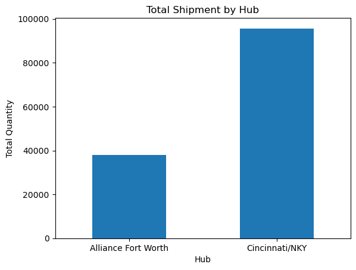
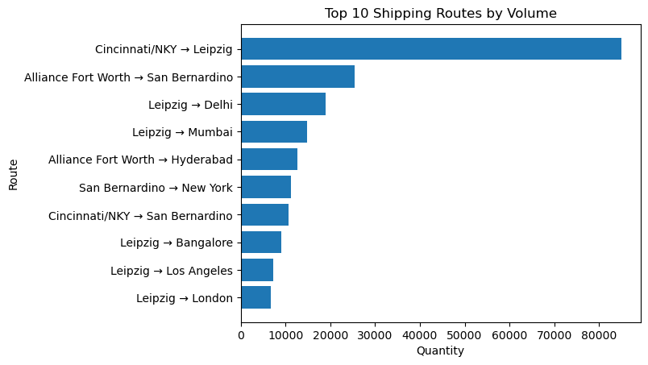

# 📦 Logistics Optimization Project (Linear Programming)

## 📌 Overview
This project applies optimization techniques to a logistics and supply chain scenario using **linear programming and Python**.

The objective is to determine the most cost-efficient way to transport goods across a network of hubs, cities, and delivery centers while satisfying operational constraints such as capacity limits and demand requirements.

---

## 🎯 Business Problem
Logistics networks often face inefficiencies that increase operational costs.

This project addresses the problem of:
- Determining optimal shipment quantities
- Selecting efficient routing paths
- Minimizing total transportation cost

**Goal:**  
Minimize total shipping cost while ensuring:
- All customer demand is fulfilled  
- Hub and city capacity constraints are respected  
- Flow is conserved across the network  

---

## 📂 Project Structure
optimization-project/
│
├── docs/
│ ├── Business_optimization.docx
│ ├── Mathematical_modeling.docx
│ └── Implementation.docx
│
├── notebooks/
│ └── Optimization.ipynb
│
├── README.md
└── .gitignore


---

## 📊 Solution Approach

### Business Optimization
- Identified logistics inefficiencies and cost drivers  
- Proposed route optimization strategy  
- Defined decision variables and constraints  

### Mathematical Modeling
- Formulated the problem as a **linear programming model**  
- Defined objective function to minimize total shipping cost  
- Established constraints:
  - Capacity limits  
  - Demand requirements  
  - Flow conservation  

### Implementation (Python)
- Implemented optimization model in Jupyter Notebook  
- Applied the **Simplex method** to solve the LP problem  
- Generated optimized shipping routes and quantities  
- Programmatically validated all constraints  

---

## 📈 Results & Insights
- Produced optimized shipment allocations across hubs, cities, and centers  
- Ensured all constraints were satisfied:
  - Hub capacity  
  - City capacity  
  - Demand fulfillment  
  - Flow balance  
- Demonstrated how optimization can improve logistics efficiency and reduce unnecessary routing  

---

## 📈 Key Result
- Total optimized shipping cost: $886,800,462.50

---

## 📊 Visual Analysis
The notebook includes visualizations to support the optimization results:
- Cost comparison (baseline vs optimized)  
- Shipment distribution by source  
- Top shipping routes by volume  

---

## 📊 Visual Results

### Total Shipment by Hub


Cincinnati/NKY handles the majority of outbound shipments, indicating it is the primary distribution hub in the optimized network.

### Top Shipping Routes


The optimization prioritizes high-volume routes from Leipzig to major demand centers such as Paris and London, minimizing overall transportation cost.

---

## 🛠 Tools & Technologies
- Python  
- Jupyter Notebook  
- Linear Programming (Simplex Method)  
- Pandas / NumPy (data handling)  
- Matplotlib (visualization)  

---

## 🚀 How to Run
1. Clone the repository:
   ```bash
   git clone https://github.com/raghem/optimization-project.git
2. Open the notebook:
 - notebooks/Optimization.ipynb
3. Run all cells to reproduce the optimization results

## Future Improvements
- Integrate real-world logistics datasets
- Scale the model for larger transportation network
- Add interactive dashboards (PowerBI/Tableau)
- Deploy as an API for real-time optimization

## Author
'Raghe Mahamud'
- Github: https://www.github.com/raghem
- LinkedIn: https://www.linkedin.com/in/raghemahamud